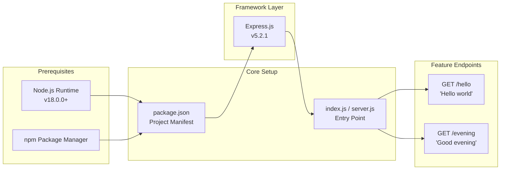
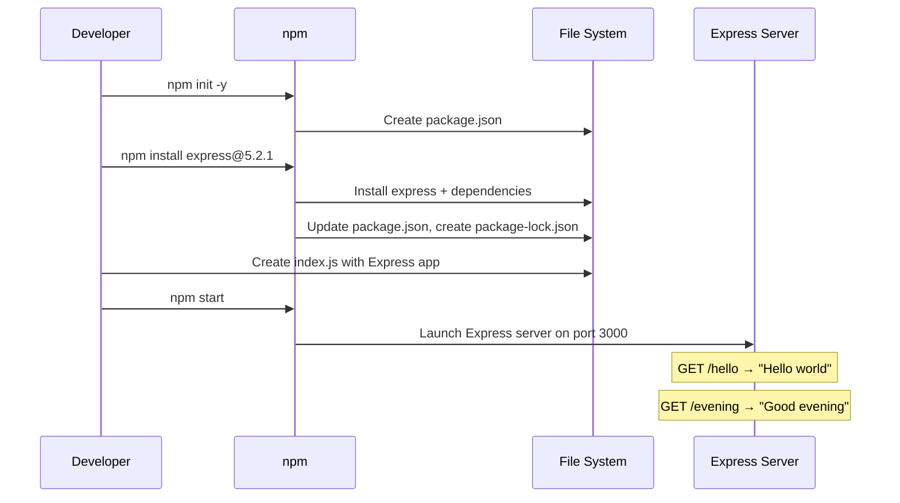
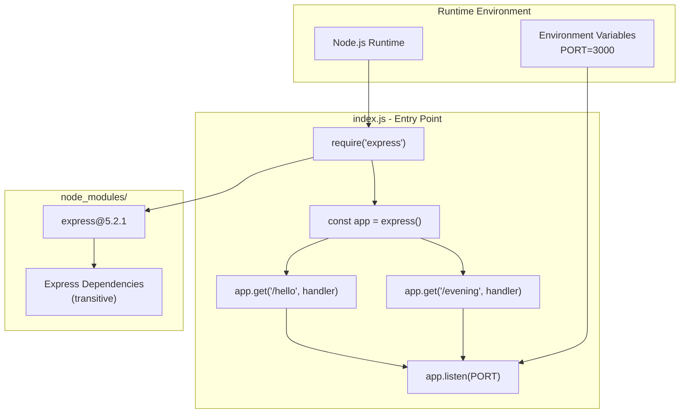
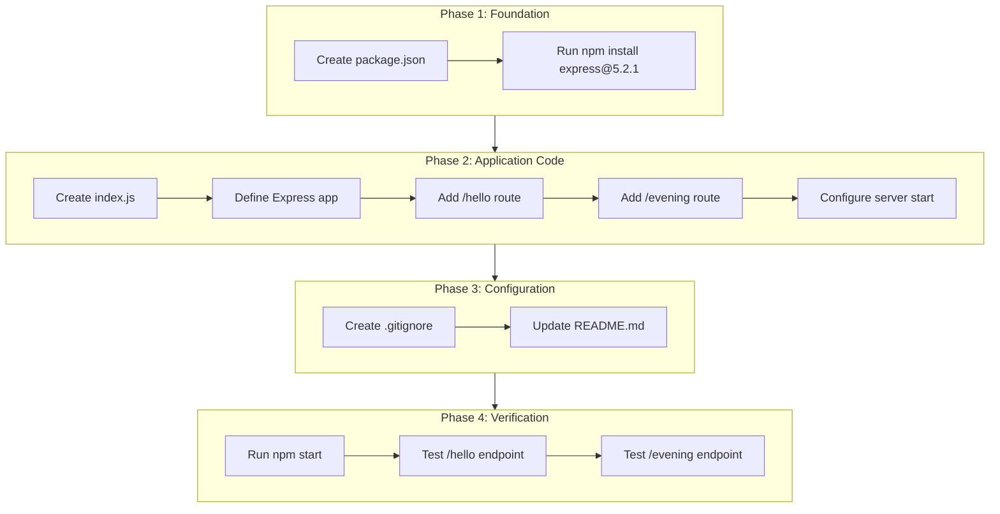
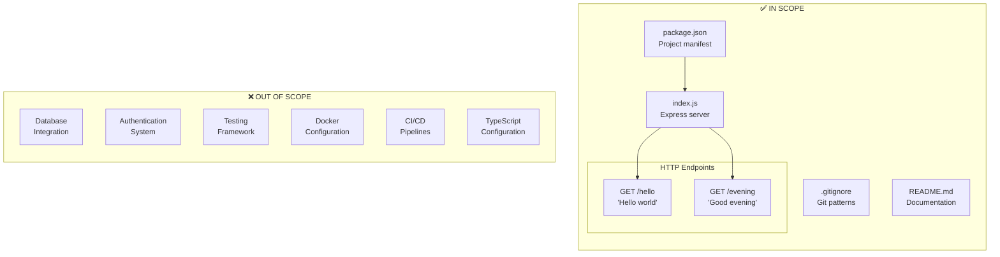

# Technical Specification

# 0. Agent Action Plan

## 0.1 Intent Clarification

### 0.1.1 Core Feature Objective

Based on the prompt, the Blitzy platform understands that the new feature requirement is to:

**Primary Objective:** Transform an empty repository into a functional Node.js server tutorial project by integrating Express.js framework and implementing HTTP endpoints.

| Requirement ID | Requirement Description | Classification |
|----------------|------------------------|----------------|
| REQ-001 | Create a Node.js server project foundation | Core Infrastructure |
| REQ-002 | Integrate Express.js as the web application framework | Framework Integration |
| REQ-003 | Implement endpoint returning "Hello world" response | Feature - Endpoint 1 |
| REQ-004 | Implement endpoint returning "Good evening" response | Feature - Endpoint 2 |

**Feature Requirements with Enhanced Clarity:**

- **Server Foundation:** Establish a properly configured Node.js project structure with package.json manifest and appropriate dependency management
- **Express.js Integration:** Add Express.js framework (latest stable version 5.2.1) as the HTTP server foundation to handle routing and request/response cycles
- **Hello World Endpoint:** Create an HTTP GET endpoint that responds with the exact text "Hello world" - this represents the baseline server functionality
- **Good Evening Endpoint:** Create an additional HTTP GET endpoint that responds with the exact text "Good evening" - this represents the new feature addition

**Implicit Requirements Detected:**

| Implicit Requirement | Rationale | Priority |
|---------------------|-----------|----------|
| Project initialization with package.json | Required for npm dependency management | Critical |
| Main entry point file (server.js or index.js) | Required to run the Node.js application | Critical |
| Start script configuration | Required to launch the server | High |
| Port configuration | Server needs a port to listen on | High |
| Basic project documentation | README should reflect server usage | Medium |

**Feature Dependencies and Prerequisites:**



### 0.1.2 Special Instructions and Constraints

**User-Specified Directives:**

| Directive | Instruction | Impact |
|-----------|-------------|--------|
| Tutorial Project | This is described as a "tutorial" project | Keep implementation simple and educational |
| Express.js Framework | Explicitly requested Express.js integration | Use Express.js for HTTP handling, not native http module |
| Exact Response Text | "Hello world" and "Good evening" | Response strings must match exactly as specified |

**Architectural Requirements:**

- **Simplicity:** Maintain a tutorial-appropriate level of complexity
- **Express.js Pattern:** Follow standard Express.js application patterns
- **RESTful Structure:** Use HTTP GET methods for the endpoints
- **Standalone Application:** Server should be runnable with a single command

**User Examples (Preserved Exactly):**

> User Request: *"this is a tutorial of node js server hosting one endpoint that returns the response 'Hello world'. Could you add expressjs into the project and add another endpoint that return the response of 'Good evening'?"*

**Web Search Research Conducted:**

| Research Topic | Finding | Source |
|----------------|---------|--------|
| Express.js Latest Version | 5.2.1 (published December 2024) | npmjs.com/package/express |
| Node.js Compatibility | Express.js 5.x requires Node.js 18+ | expressjs.com |
| Express.js 5.0 Changes | Updated dependencies, improved security, async middleware support | GitHub expressjs/express releases |

### 0.1.3 Technical Interpretation

These feature requirements translate to the following technical implementation strategy:

| User Requirement | Technical Translation | Implementation Action |
|------------------|----------------------|----------------------|
| "Node.js server tutorial" | Initialize Node.js project structure | Run `npm init` to create package.json |
| "Add Express.js" | Install Express.js as production dependency | Run `npm install express@5.2.1` |
| "One endpoint returns Hello world" | HTTP GET route with text response | Create route: `app.get('/hello', ...)` |
| "Another endpoint returns Good evening" | Additional HTTP GET route | Create route: `app.get('/evening', ...)` |

**Technical Action Mapping:**

- **To create the Node.js project foundation**, we will **create** the following core files:
  - `package.json` - Project manifest with name, version, main entry point, and scripts
  - `index.js` - Main application entry point containing Express.js server configuration

- **To integrate Express.js into the project**, we will **install and configure**:
  - Express.js package (v5.2.1) as a production dependency
  - Server initialization with `express()` factory function
  - Port configuration (default 3000 or from environment variable)

- **To implement the Hello World endpoint**, we will **create**:
  - GET route handler at path `/hello` (or root `/`)
  - Response handler that sends the exact string "Hello world"

- **To implement the Good Evening endpoint**, we will **create**:
  - GET route handler at path `/evening`
  - Response handler that sends the exact string "Good evening"

**Implementation Flow:**




## 0.2 Repository Scope Discovery

### 0.2.1 Comprehensive File Analysis

**Current Repository State:**

The repository is newly initialized with minimal content. The complete file inventory is:

| File Path | Type | Status | Purpose |
|-----------|------|--------|---------|
| `README.md` | Documentation | EXISTS | Project identification (contains only "# 11DEc_1") |
| `.git/` | Directory | EXISTS | Git version control |

**Search Patterns Applied:**

| Pattern | Results | Analysis |
|---------|---------|----------|
| `**/*.js` | 0 matches | No JavaScript source files exist |
| `**/*.ts` | 0 matches | No TypeScript source files exist |
| `**/package.json` | 0 matches | No Node.js project manifest exists |
| `**/*.json` | 0 matches | No JSON configuration files |
| `**/*.yaml`, `**/*.yml` | 0 matches | No YAML configuration files |
| `**/test/**/*`, `**/*test*.js` | 0 matches | No test files exist |
| `**/Dockerfile*` | 0 matches | No Docker configuration |
| `**/.github/**/*` | 0 matches | No GitHub Actions workflows |

**Integration Point Discovery:**

Since the repository is empty (greenfield project), there are no existing integration points. All components must be created from scratch:

| Integration Category | Current State | Required Action |
|---------------------|---------------|-----------------|
| API Endpoints | None exist | Create new Express.js routes |
| Database Models | None exist | Not required for this feature |
| Service Classes | None exist | Not required (simple tutorial) |
| Controllers/Handlers | None exist | Create route handlers in main file |
| Middleware | None exist | Not required for basic tutorial |
| Configuration Files | None exist | Create package.json |

**Existing Modules Analysis:**

| Module Category | Existing Files | Files to Modify | Rationale |
|-----------------|----------------|-----------------|-----------|
| Source Code | None | N/A | All new files required |
| Configuration | None | N/A | package.json to be created |
| Documentation | README.md | README.md | Update with server documentation |
| Tests | None | N/A | Test files to be created |

### 0.2.2 Web Search Research Conducted

| Research Area | Query Performed | Key Finding | Application |
|---------------|-----------------|-------------|-------------|
| Express.js Version | "Express.js latest stable version 2024" | Version 5.2.1 is current stable | Use `express@5.2.1` in dependencies |
| Node.js Compatibility | (from Express.js docs) | Requires Node.js 18+ | Current Node.js v20.19.6 is compatible |
| Express.js Basic Setup | Best practices for Express.js setup | Use `express()` factory, `app.listen()` | Follow standard patterns |
| Security Considerations | Express.js 5.x security updates | CVE-2024-45590 mitigated in 5.x | Use latest version for security |

**Best Practices Identified:**

- Use ES modules or CommonJS consistently (CommonJS for tutorial simplicity)
- Define PORT via environment variable with fallback
- Use descriptive route paths (`/hello`, `/evening`)
- Return appropriate content-type headers (Express handles automatically)

### 0.2.3 New File Requirements

**New Source Files to Create:**

| File Path | Purpose | Content Overview |
|-----------|---------|------------------|
| `index.js` | Main application entry point | Express.js server with two GET endpoints |
| `package.json` | Project manifest | Name, version, dependencies, scripts |

**Detailed File Specifications:**

**`package.json` - Project Manifest**
```json
{
  "name": "11dec_1",
  "version": "1.0.0",
  "main": "index.js"
}
```

**`index.js` - Express Server Entry Point**
```javascript
const express = require('express');
const app = express();
// ... route definitions and server start
```

**New Test Files (Recommended):**

| File Path | Purpose | Test Coverage |
|-----------|---------|---------------|
| `tests/server.test.js` | Unit/Integration tests | Endpoint response validation |

**New Configuration (Optional but Recommended):**

| File Path | Purpose | Configuration |
|-----------|---------|---------------|
| `.gitignore` | Git ignore patterns | `node_modules/`, `.env` |
| `.env.example` | Environment template | `PORT=3000` |

**Complete New File Inventory:**

| Priority | File | Type | Purpose |
|----------|------|------|---------|
| Critical | `package.json` | Config | npm project manifest with express dependency |
| Critical | `index.js` | Source | Express server with `/hello` and `/evening` routes |
| High | `README.md` | Docs | Update existing file with usage instructions |
| Medium | `.gitignore` | Config | Exclude node_modules and environment files |
| Low | `tests/server.test.js` | Test | Optional endpoint testing |

### 0.2.4 Repository Structure After Implementation

```
11DEc_1/
├── .git/                    # Existing - Git repository
├── .gitignore               # NEW - Git ignore patterns
├── index.js                 # NEW - Express server entry point
├── package.json             # NEW - npm project manifest
├── package-lock.json        # NEW - Auto-generated by npm
├── node_modules/            # NEW - Auto-generated by npm install
│   └── express/             # Express.js and dependencies
└── README.md                # MODIFY - Add server documentation
```


## 0.3 Dependency Inventory

### 0.3.1 Private and Public Packages

**Runtime Environment:**

| Component | Version | Source | Status |
|-----------|---------|--------|--------|
| Node.js | v20.19.6 | System installed | Available |
| npm | v11.1.0 | Bundled with Node.js | Available |

**Production Dependencies:**

| Registry | Package Name | Version | Purpose | Verification |
|----------|--------------|---------|---------|--------------|
| npmjs.com | `express` | 5.2.1 | Web application framework for HTTP routing | Verified via npm registry search (published December 2024) |

**Express.js Transitive Dependencies (Auto-Installed):**

| Package | Purpose |
|---------|---------|
| `accepts` | HTTP content negotiation |
| `body-parser` | Request body parsing |
| `content-type` | Parse HTTP Content-Type header |
| `cookie` | HTTP cookie parsing |
| `debug` | Debug logging utility |
| `encodeurl` | URL encoding |
| `finalhandler` | Final HTTP responder |
| `fresh` | HTTP response freshness |
| `merge-descriptors` | Object descriptor merging |
| `methods` | HTTP methods list |
| `on-finished` | Execute callback on HTTP response finish |
| `parseurl` | Parse request URL |
| `path-to-regexp` | Express route path matching |
| `qs` | Query string parsing |
| `range-parser` | Range header parsing |
| `raw-body` | Raw request body parsing |
| `router` | Express router module |
| `send` | Static file serving |
| `serve-static` | Static file middleware |
| `statuses` | HTTP status codes |
| `type-is` | Request content type checking |
| `vary` | HTTP Vary header manipulation |

**Development Dependencies (Recommended):**

| Registry | Package Name | Version | Purpose |
|----------|--------------|---------|---------|
| npmjs.com | `nodemon` | ^3.1.0 | Auto-restart server on file changes (dev only) |

**Private Packages:**

| Registry | Package Name | Version | Purpose |
|----------|--------------|---------|---------|
| N/A | None required | N/A | No private packages needed for this tutorial |

### 0.3.2 Dependency Changes

**New Dependencies to Add:**

| Action | Package | Version | Target File |
|--------|---------|---------|-------------|
| ADD | express | 5.2.1 | package.json (dependencies) |
| ADD | nodemon | ^3.1.0 | package.json (devDependencies) - Optional |

**package.json Dependencies Block:**

```json
{
  "dependencies": {
    "express": "5.2.1"
  }
}
```

### 0.3.3 Import Updates

Since this is a greenfield project, there are no existing import statements to update. The following import patterns will be established:

**New Import Patterns:**

| File | Import Statement | Purpose |
|------|------------------|---------|
| `index.js` | `const express = require('express');` | Import Express.js framework |

**Import Style Convention:**

- Use CommonJS `require()` syntax for tutorial simplicity
- Alternative ES Modules syntax: `import express from 'express';` (requires `"type": "module"` in package.json)

### 0.3.4 External Reference Updates

**Configuration Files:**

| File | Update Type | Changes |
|------|-------------|---------|
| `package.json` | CREATE | Add express to dependencies |
| `.gitignore` | CREATE | Add `node_modules/` pattern |

**Documentation Updates:**

| File | Update Type | Changes |
|------|-------------|---------|
| `README.md` | MODIFY | Add installation and usage instructions |

**No Changes Required:**

| Category | Reason |
|----------|--------|
| CI/CD Workflows | No existing .github/workflows/ files |
| Build Configuration | No existing build files (setup.py, pyproject.toml, etc.) |
| Docker Configuration | No existing Dockerfile |

### 0.3.5 Dependency Verification Commands

The following commands should be executed during implementation to verify dependencies:

| Step | Command | Expected Outcome |
|------|---------|------------------|
| 1 | `npm init -y` | Creates package.json with defaults |
| 2 | `npm install express@5.2.1` | Installs Express.js and creates package-lock.json |
| 3 | `npm ls express` | Shows installed express version as 5.2.1 |
| 4 | `node -e "console.log(require('express').version)"` | Outputs: 5.2.1 (after installation) |


## 0.4 Integration Analysis

### 0.4.1 Existing Code Touchpoints

**Current Repository Integration Status:**

Since the repository contains only `README.md`, there are no existing code touchpoints requiring modification. This is a **greenfield implementation** where all integration points will be created fresh.

| Integration Category | Existing Code | Action Required |
|---------------------|---------------|-----------------|
| Express Application | None | CREATE new Express app instance |
| Route Handlers | None | CREATE `/hello` and `/evening` routes |
| Server Configuration | None | CREATE server listening configuration |
| Documentation | README.md (minimal) | MODIFY to include server documentation |

### 0.4.2 Direct Modifications Required

**File: `README.md`**

| Modification | Location | Change Description |
|--------------|----------|-------------------|
| Add project description | Lines 1-5 | Replace placeholder title with descriptive content |
| Add installation instructions | After description | npm install command |
| Add usage instructions | After installation | npm start command and endpoint documentation |
| Add endpoint reference | After usage | Document /hello and /evening endpoints |

**Approximate README.md Structure After Modification:**

```
# 11DEc_1 - Node.js Express Tutorial

#### Description
Node.js server tutorial with Express.js

#### Installation
npm install

#### Usage
npm start
```

### 0.4.3 New Integration Points

All integration points for this feature will be created in new files:

**`index.js` - Core Application Integration**

| Integration Point | Line Location (Approx) | Purpose |
|-------------------|------------------------|---------|
| Express Import | Line 1 | Import Express.js framework |
| App Initialization | Line 2 | Create Express application instance |
| Hello Endpoint | Lines 4-6 | Define GET /hello route handler |
| Evening Endpoint | Lines 8-10 | Define GET /evening route handler |
| Server Start | Lines 12-14 | Start server on configured port |

**`package.json` - Configuration Integration**

| Integration Point | Location | Purpose |
|-------------------|----------|---------|
| Name field | Top level | Project identification |
| Main field | Top level | Entry point specification |
| Scripts.start | scripts object | Define startup command |
| Dependencies | dependencies object | Express.js version lock |

### 0.4.4 Dependency Injections

Since this is a minimal tutorial application, formal dependency injection is not required. The application follows a simple pattern:

| Component | Injection Method | Usage |
|-----------|------------------|-------|
| Express | Module import | `const express = require('express')` |
| App instance | Factory function | `const app = express()` |
| Port configuration | Environment variable | `process.env.PORT \|\| 3000` |

**Integration Architecture:**



### 0.4.5 Database/Schema Updates

**Not Applicable for This Feature**

| Aspect | Status | Reason |
|--------|--------|--------|
| Database Migrations | Not Required | Tutorial returns static string responses |
| Schema Additions | Not Required | No data persistence needed |
| ORM/ODM Models | Not Required | No database interaction |

### 0.4.6 External Service Integration

**Not Applicable for This Feature**

| Service Type | Required | Reason |
|--------------|----------|--------|
| Authentication | No | Simple tutorial without auth |
| Database | No | Static responses only |
| Caching | No | Simple response handling |
| Message Queue | No | Synchronous request/response only |
| Third-party APIs | No | Self-contained functionality |

### 0.4.7 Integration Test Points

The following integration points should be validated after implementation:

| Test Case ID | Integration Point | Expected Behavior |
|--------------|-------------------|-------------------|
| INT-001 | Server Startup | Server starts on PORT 3000 (or configured port) |
| INT-002 | GET /hello | Returns 200 status with body "Hello world" |
| INT-003 | GET /evening | Returns 200 status with body "Good evening" |
| INT-004 | Invalid Route | Returns 404 for undefined routes |

**Manual Verification Commands:**

| Test | Command | Expected Output |
|------|---------|-----------------|
| Server startup | `npm start` | "Server running on port 3000" |
| Hello endpoint | `curl http://localhost:3000/hello` | "Hello world" |
| Evening endpoint | `curl http://localhost:3000/evening` | "Good evening" |


## 0.5 Technical Implementation

### 0.5.1 File-by-File Execution Plan

**CRITICAL: Every file listed below MUST be created or modified as specified.**

**Group 1 - Project Foundation Files:**

| Action | File Path | Purpose | Priority |
|--------|-----------|---------|----------|
| CREATE | `package.json` | npm project manifest with Express.js dependency | Critical |
| CREATE | `index.js` | Express server entry point with route definitions | Critical |

**Group 2 - Configuration Files:**

| Action | File Path | Purpose | Priority |
|--------|-----------|---------|----------|
| CREATE | `.gitignore` | Git ignore patterns for node_modules and environment files | High |

**Group 3 - Documentation Files:**

| Action | File Path | Purpose | Priority |
|--------|-----------|---------|----------|
| MODIFY | `README.md` | Update with installation, usage, and endpoint documentation | High |

**Group 4 - Auto-Generated Files (via npm):**

| Action | File Path | Purpose | Generated By |
|--------|-----------|---------|--------------|
| AUTO | `package-lock.json` | Dependency lock file | `npm install` |
| AUTO | `node_modules/` | Installed dependencies directory | `npm install` |

### 0.5.2 Implementation Approach per File

---

#### File 1: `package.json` (CREATE)

**Purpose:** Define the Node.js project structure, dependencies, and scripts.

**Implementation Details:**

| Field | Value | Purpose |
|-------|-------|---------|
| `name` | "11dec_1" | Project identifier |
| `version` | "1.0.0" | Initial version |
| `description` | "Node.js Express tutorial server" | Project description |
| `main` | "index.js" | Entry point file |
| `scripts.start` | "node index.js" | Startup command |
| `dependencies.express` | "5.2.1" | Express.js framework |

**Content Structure:**

```json
{
  "name": "11dec_1",
  "version": "1.0.0",
  "main": "index.js"
}
```

---

#### File 2: `index.js` (CREATE)

**Purpose:** Main application entry point containing Express server and route definitions.

**Implementation Details:**

| Component | Implementation | Line Approx |
|-----------|----------------|-------------|
| Express Import | `const express = require('express');` | 1 |
| App Instance | `const app = express();` | 2 |
| Port Config | `const PORT = process.env.PORT \|\| 3000;` | 3 |
| Hello Route | `app.get('/hello', (req, res) => res.send('Hello world'));` | 5-7 |
| Evening Route | `app.get('/evening', (req, res) => res.send('Good evening'));` | 9-11 |
| Server Start | `app.listen(PORT, () => console.log(...));` | 13-15 |

**Route Definitions:**

| Route | Method | Handler | Response |
|-------|--------|---------|----------|
| `/hello` | GET | Callback function | "Hello world" |
| `/evening` | GET | Callback function | "Good evening" |

**Content Structure:**

```javascript
const express = require('express');
const app = express();
// ... routes and server start
```

---

#### File 3: `.gitignore` (CREATE)

**Purpose:** Define patterns for files and directories Git should ignore.

**Implementation Details:**

| Pattern | Purpose |
|---------|---------|
| `node_modules/` | Exclude npm dependencies |
| `.env` | Exclude environment secrets |
| `.env.local` | Exclude local environment overrides |
| `*.log` | Exclude log files |

---

#### File 4: `README.md` (MODIFY)

**Purpose:** Update existing README with comprehensive project documentation.

**Implementation Details:**

| Section | Content Purpose |
|---------|-----------------|
| Title | Project name and description |
| Description | Brief overview of the tutorial server |
| Installation | `npm install` command |
| Usage | `npm start` command |
| Endpoints | Table of available HTTP endpoints |
| Response Examples | Expected responses for each endpoint |

### 0.5.3 Implementation Sequence



### 0.5.4 Implementation Commands

| Step | Command | Purpose | Working Directory |
|------|---------|---------|-------------------|
| 1 | `npm init -y` | Initialize package.json | Project root |
| 2 | `npm install express@5.2.1` | Install Express.js | Project root |
| 3 | Create `index.js` | Write server code | Project root |
| 4 | Create `.gitignore` | Write ignore patterns | Project root |
| 5 | Update `README.md` | Write documentation | Project root |
| 6 | `npm start` | Verify server starts | Project root |
| 7 | `curl localhost:3000/hello` | Test hello endpoint | Any terminal |
| 8 | `curl localhost:3000/evening` | Test evening endpoint | Any terminal |

### 0.5.5 Quality Gates

| Gate | Validation Criteria | Pass Condition |
|------|---------------------|----------------|
| Dependency Installation | npm install completes without errors | Exit code 0 |
| Server Startup | Server binds to port successfully | Console shows "Server running" |
| Hello Endpoint | GET /hello returns expected response | Response body equals "Hello world" |
| Evening Endpoint | GET /evening returns expected response | Response body equals "Good evening" |
| Documentation | README contains usage instructions | Sections present for install/usage |


## 0.6 Scope Boundaries

### 0.6.1 Exhaustively In Scope

**All Feature Source Files:**

| File Pattern | Specific Files | Purpose |
|--------------|----------------|---------|
| `*.js` | `index.js` | Main Express server application |
| `package*.json` | `package.json`, `package-lock.json` | Project manifest and dependency lock |

**All Configuration Files:**

| File Pattern | Specific Files | Purpose |
|--------------|----------------|---------|
| `.gitignore` | `.gitignore` | Git ignore patterns |
| `.*` | `.env.example` (optional) | Environment variable template |

**All Documentation Files:**

| File Pattern | Specific Files | Purpose |
|--------------|----------------|---------|
| `*.md` | `README.md` | Project documentation |

**Integration Points:**

| Component | File | Lines (Approx) | Change Description |
|-----------|------|----------------|-------------------|
| Express app initialization | `index.js` | 1-3 | Import and create Express instance |
| Hello route handler | `index.js` | 5-7 | GET /hello endpoint definition |
| Evening route handler | `index.js` | 9-11 | GET /evening endpoint definition |
| Server listener | `index.js` | 13-15 | Start server on configured port |
| npm scripts | `package.json` | scripts block | Define start command |
| Dependencies | `package.json` | dependencies block | Express.js version specification |

**Complete In-Scope File List:**

| Priority | File | Action | Purpose |
|----------|------|--------|---------|
| Critical | `package.json` | CREATE | npm project manifest |
| Critical | `index.js` | CREATE | Express server with endpoints |
| Critical | `package-lock.json` | AUTO-CREATE | Dependency version lock |
| High | `.gitignore` | CREATE | Git ignore patterns |
| High | `README.md` | MODIFY | Project documentation |
| High | `node_modules/` | AUTO-CREATE | npm dependencies |

**In-Scope Functionality:**

| Feature | Status | Description |
|---------|--------|-------------|
| Express.js Integration | IN SCOPE | Add Express.js as project framework |
| GET /hello Endpoint | IN SCOPE | Return "Hello world" response |
| GET /evening Endpoint | IN SCOPE | Return "Good evening" response |
| Server Port Configuration | IN SCOPE | PORT environment variable support |
| Project Documentation | IN SCOPE | README with usage instructions |
| Git Ignore Configuration | IN SCOPE | Exclude node_modules from version control |

### 0.6.2 Explicitly Out of Scope

**Not Included in This Implementation:**

| Category | Items | Reason |
|----------|-------|--------|
| **Additional Endpoints** | Any routes beyond /hello and /evening | Not requested by user |
| **Database Integration** | MongoDB, PostgreSQL, MySQL, etc. | Not required for tutorial |
| **Authentication** | JWT, OAuth, Session management | Not specified in requirements |
| **Middleware** | CORS, Helmet, Morgan, etc. | Not specified in requirements |
| **Testing Framework** | Jest, Mocha, Supertest setup | Optional for basic tutorial |
| **TypeScript** | TypeScript configuration | User requested plain JavaScript |
| **Docker Configuration** | Dockerfile, docker-compose.yml | Not specified in requirements |
| **CI/CD Pipelines** | GitHub Actions, Jenkins, etc. | Not specified in requirements |
| **Production Deployment** | AWS, Heroku, Vercel setup | Not specified in requirements |
| **Environment Configuration** | .env file creation | .env.example template only |
| **Error Handling Middleware** | Custom error handlers | Not specified in requirements |
| **Request Logging** | Morgan or custom logging | Not specified in requirements |
| **API Documentation** | Swagger/OpenAPI specs | Not specified in requirements |
| **Rate Limiting** | Express-rate-limit | Not specified in requirements |
| **Input Validation** | Express-validator | No input parameters required |

**Explicitly Excluded Modifications:**

| File Pattern | Reason |
|--------------|--------|
| `src/**/*` | No source directory structure requested |
| `config/**/*` | No separate configuration files needed |
| `tests/**/*` | Testing not explicitly requested |
| `docs/**/*` | Documentation via README only |
| `.github/**/*` | No CI/CD workflows requested |
| `Dockerfile*` | No containerization requested |
| `*.yaml`, `*.yml` | No YAML configuration needed |
| `*.ts`, `*.tsx` | TypeScript not requested |

**Future Enhancements (NOT in current scope):**

| Enhancement | Category | Why Excluded |
|-------------|----------|--------------|
| Unit tests with Jest | Testing | Not explicitly requested |
| Integration tests with Supertest | Testing | Not explicitly requested |
| ESLint configuration | Code Quality | Not explicitly requested |
| Prettier configuration | Code Formatting | Not explicitly requested |
| Nodemon for development | DevX | Not explicitly requested |
| Health check endpoint | Operations | Not explicitly requested |
| Graceful shutdown | Operations | Not explicitly requested |
| Environment-specific configs | Configuration | Not explicitly requested |

### 0.6.3 Scope Boundary Diagram




## 0.7 Special Instructions for Feature Addition

### 0.7.1 Feature-Specific Requirements

**User-Emphasized Instructions:**

| Instruction | Source | Implementation Impact |
|-------------|--------|----------------------|
| "Tutorial" project | User prompt | Keep code simple, educational, and well-commented |
| "Express.js" integration | User prompt | Use Express.js framework, not native http module |
| Exact response strings | User prompt | "Hello world" and "Good evening" must be exact |

**Patterns and Conventions to Follow:**

| Convention | Application | Example |
|------------|-------------|---------|
| CommonJS Modules | Use `require()` syntax | `const express = require('express');` |
| Express Factory Pattern | Standard app initialization | `const app = express();` |
| Arrow Function Handlers | Route callbacks | `(req, res) => res.send('...')` |
| Environment Variable Port | Configuration best practice | `process.env.PORT \|\| 3000` |
| Lowercase Route Paths | URL convention | `/hello`, `/evening` |

### 0.7.2 Integration Requirements with Existing Features

**Current State:** The repository has no existing features to integrate with. This is a greenfield project.

**Integration Approach:**

| Aspect | Approach | Rationale |
|--------|----------|-----------|
| Express Framework | Standalone application | No existing server infrastructure |
| Routing | Define routes in main file | Tutorial simplicity |
| Configuration | Environment variables | Standard Node.js practice |
| Documentation | Update existing README | Single documentation source |

### 0.7.3 Performance Considerations

**For Tutorial Scope:**

| Consideration | Status | Reasoning |
|---------------|--------|-----------|
| Response Caching | Not Required | Static string responses |
| Compression | Not Required | Minimal payload size |
| Clustering | Not Required | Tutorial/development use |
| Load Balancing | Not Required | Single instance sufficient |

**Default Express Performance Settings:**

| Setting | Value | Note |
|---------|-------|------|
| Response Buffering | Enabled | Express default |
| Keep-Alive | Enabled | Express 5.x default |
| ETag | Enabled | Express default |

### 0.7.4 Security Requirements

**Minimum Security for Tutorial:**

| Security Aspect | Implementation | Priority |
|-----------------|----------------|----------|
| Dependencies | Use latest Express.js (5.2.1) | High |
| Port Binding | localhost only for development | Medium |
| Input Validation | Not applicable (no input) | N/A |
| HTTPS | Not required for local tutorial | Low |

**Security-Related Express.js 5.x Updates:**

| CVE | Status | Note |
|-----|--------|------|
| CVE-2024-45590 | Mitigated | ReDoS fix included in 5.x |

### 0.7.5 Environment Variables

**Required Environment Variables:**

| Variable | Required | Default | Purpose |
|----------|----------|---------|---------|
| `PORT` | No | 3000 | Server port number |

**User-Provided Environment Variables:**

| Variable | Value | Usage |
|----------|-------|-------|
| `aaa` | (user-provided) | Available in environment |

**User-Provided Secrets:**

| Secret | Value | Usage |
|--------|-------|-------|
| `aa` | (user-provided) | Available in environment |

**Note:** The user-provided environment variables (`aaa`) and secrets (`aa`) are available in the runtime environment but are not utilized by this simple tutorial server implementation.

### 0.7.6 Validation Criteria

**Implementation Success Criteria:**

| Criterion | Validation Method | Pass Condition |
|-----------|-------------------|----------------|
| Project Initializes | `npm install` | No errors, express in node_modules |
| Server Starts | `npm start` | Console shows port binding message |
| Hello Endpoint Works | `curl localhost:3000/hello` | Response body is exactly "Hello world" |
| Evening Endpoint Works | `curl localhost:3000/evening` | Response body is exactly "Good evening" |
| HTTP Status Codes | Check response headers | 200 OK for valid routes |
| Content-Type | Check response headers | text/html (Express default for strings) |

**Acceptance Test Cases:**

| Test ID | Test Description | Expected Result |
|---------|------------------|-----------------|
| TC-001 | Start server with `npm start` | Server starts, logs port number |
| TC-002 | GET request to /hello | Returns "Hello world" with 200 status |
| TC-003 | GET request to /evening | Returns "Good evening" with 200 status |
| TC-004 | GET request to undefined route | Returns 404 status |
| TC-005 | POST request to /hello | Returns 404 (only GET supported) |

### 0.7.7 Setup Commands Summary

**Complete Setup Sequence:**

```bash
# Navigate to project directory
cd /path/to/11DEc_1

#### Initialize npm project (if not exists)
npm init -y

#### Install Express.js
npm install express@5.2.1

#### Start the server
npm start
```

**Verification Commands:**

```bash
# Test Hello endpoint
curl http://localhost:3000/hello

#### Test Evening endpoint
curl http://localhost:3000/evening
```

**Expected Outputs:**

| Command | Output |
|---------|--------|
| `npm start` | "Server running on port 3000" |
| `curl localhost:3000/hello` | "Hello world" |
| `curl localhost:3000/evening` | "Good evening" |


